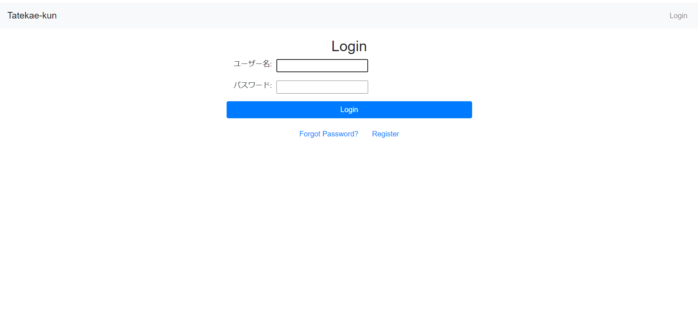
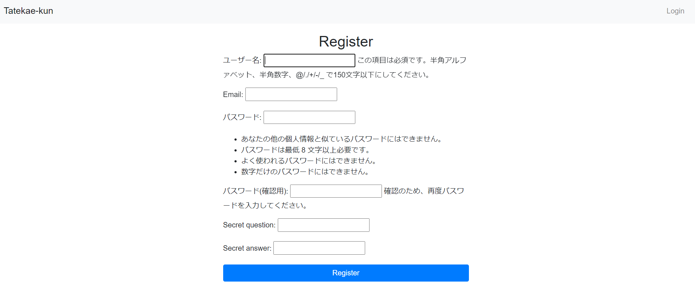
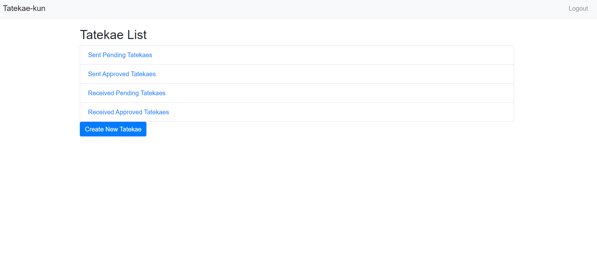
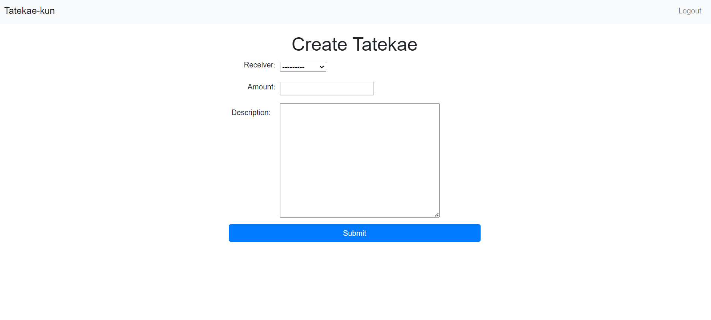
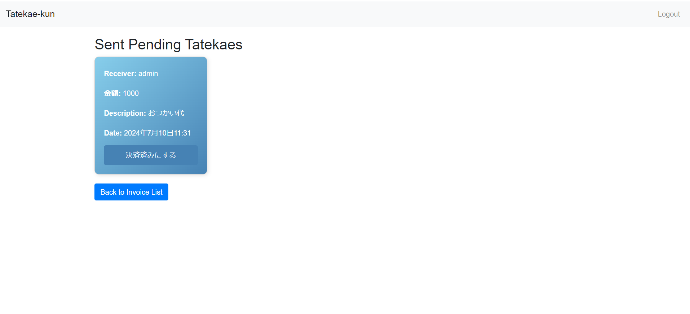

# Tatekae-kun
## 概要
Tatekae-Kunは、ユーザー間の請求書管理を行うためのDjangoアプリケーションです。
このアプリケーションでは、ユーザーは他のユーザーに対して請求書を送信し、承認された請求書や未承認の請求書を管理することができます。
2024年7月現在[Azureのサーバ](https://tatekae-kiroku-kun.japaneast.cloudapp.azure.com/)で公開しております(このアプリはAzure Studentの内容の変更等により予告なく終了する恐れがあります)。
## 開発の経緯
このアプリケーションは、家族や友人の買い物を代行した際の建て替えをした際に、自分はいくら支払ったかを忘れてしまい、レシートもなくしてしまった経験から、こうした建て替えの管理を簡単に行うことが出来るアプリケーションがあれば便利だと考えたことから開発を始めました。
## 機能
- ユーザー登録と認証
- 請求書の作成、送信、承認
- 承認済みおよび未承認の請求書の管理
- 秘密の質問と回答によるパスワードリセット
## 使用方法
### ログイン
ユーザ名、パスワードを入力してログインします。

### ユーザ登録
ログインページよりregisterをクリックし、必要事項を入力します。
秘密の質問はパスワードのリセット時に使用します。

### パスワードのリセット
ログインページよりForgot Passwordをクリックし、ユーザ名と秘密の質問に答えることでパスワードをリセットすることができます。
### メイン画面
- Sent Pending Tatekaes : 送信した未承認の請求書
- Sent Approved Tatekaes : 送信した承認済みの請求書
- Received Pending Tatekaes : 受信した未承認の請求書
- Received Approved Tatekaes : 受信した承認済みの請求書

### 請求書の作成
メイン画面よりCreate Tatekaeをクリックし、必要事項を入力します。
submitをクリックすると請求書が作成されます。

### 請求書の確認
メイン画面より確認したい請求書をクリックします。
送信済み未承認の請求書の場合、承認ボタンが表示されます。
承認ボタンをクリックすると請求書が承認されます。

## ToDo
- [ ] 請求書の削除
- [ ] 請求書の編集
- [ ] 送信元、送信先ごとの請求書の表示
- [ ] デザインの洗練